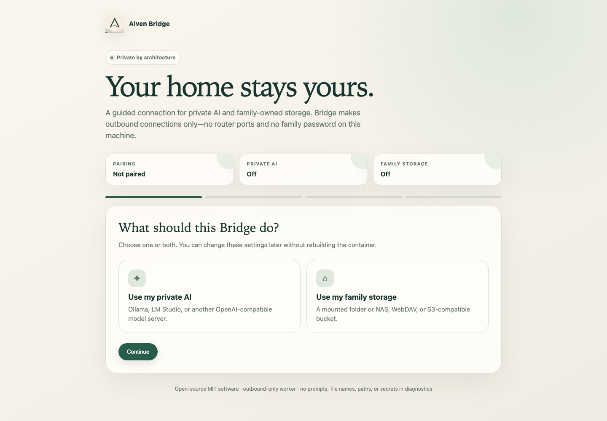

<p align="center">
  
</p>

<h1 align="center">Alven Bridge</h1>

<p align="center">
  Your private AI and family-owned storage, connected to Alven without opening your home network to the internet.
</p>

<p align="center">
  <a href="#five-minute-setup">Quick start</a> ·
  <a href="#what-it-connects">Capabilities</a> ·
  <a href="SECURITY.md">Security</a> ·
  <a href="SUPPORT.md">Support</a>
</p>



Alven Bridge is a small open-source service that runs on a computer, home server, or NAS. It connects
one Alven Family Workspace to resources you operate yourself while the hosted Alven service continues to
handle family permissions, validation, and synchronization.

The connection is **outbound only**. There is no inbound Alven tunnel, no router port to expose, and no
Owner password copied to the machine. Every installation can be revoked from the Alven app.

## What it connects

| Capability | Works with | What stays under your control |
| --- | --- | --- |
| Private AI | Ollama, LM Studio, or another OpenAI-compatible endpoint | Model, endpoint, prompts processed locally, and compute |
| Family storage | A mounted disk, server folder, or NAS share | Original family files and the physical storage |

Private AI results are treated as untrusted proposals and must pass the same Alven authorization and
validation rules as managed AI. They consume **zero Smart Actions**. Bridge storage is a file store, not a
self-hosted copy of the Alven backend: users, permissions, structured records, and synchronization remain
in the hosted Alven service.

## System requirements

- Docker Desktop 4.30+ or Docker Engine 26+ with Compose v2;
- a 64-bit `amd64` or `arm64` Linux host (Docker Desktop also works on current macOS and Windows);
- about 100 MB for Bridge itself, plus a small persistent state volume;
- outbound HTTPS access to the Alven API;
- optional: Ollama/LM Studio and enough memory for the selected model;
- optional: an already mounted local/NAS folder, WebDAV account, or S3-compatible bucket for family files.

The current preview relay supports files up to **5 MB each**. The wizard and worker reject a larger
configured limit because the v1 control-plane protocol is bounded and non-streaming. Larger-file
streaming will ship as a versioned protocol capability; Bridge does not silently accept a limit it
cannot deliver end to end.

Bridge does not need a public IP, an inbound firewall rule, Kubernetes, or a separate database.

## Five-minute setup

### macOS or Linux

Choose an empty folder where you want to keep the small Bridge configuration and run:

```bash
curl -fsSL https://raw.githubusercontent.com/IlyaBaikou/Alven-Bridge/main/scripts/install.sh | sh
```

### Windows PowerShell

Open PowerShell in an empty folder and run:

```powershell
irm https://raw.githubusercontent.com/IlyaBaikou/Alven-Bridge/main/scripts/install.ps1 | iex
```

Both installers check Docker, download the public Compose definition, preserve an existing `.env`,
start the container, wait for its local health endpoint, and open the setup page. By default the files
are placed in an `alven-bridge` folder beneath the current directory. Set
`ALVEN_BRIDGE_INSTALL_DIR` first if you prefer another location.

If you prefer to inspect every command before it runs, download this repository and start manually:

```bash
cp .env.example .env
mkdir -p family-files
docker compose up -d
```

Then complete the four short steps at [http://127.0.0.1:7433](http://127.0.0.1:7433):

1. choose private AI, family storage, or both;
2. enter only the settings needed by those choices and run the built-in health checks;
3. create a one-time code in **Alven → More → Storage & AI → Alven Bridge** and pair;
4. wait for the ready screen to confirm Alven contact and every enabled capability.

The code expires after ten minutes and works once. A failed or cancelled pairing never selects Bridge as
the family's storage provider. You can download a content-redacted diagnostic JSON from the final step;
it contains no prompts, model names, endpoints, paths, file names, credentials, or tokens.

The published image is `ghcr.io/ilyabaikou/alven-bridge:latest` for `linux/amd64` and `linux/arm64`.
Tagged releases include provenance, an SBOM, an operator archive, and its SHA-256 checksum. For a durable
home-server installation, pin `ALVEN_BRIDGE_IMAGE` in `.env` to a semantic release tag after setup. To
build the exact checked-out source locally:

```bash
docker compose -f compose.yaml -f compose.dev.yaml up -d --build
```

## Connect a NAS or local folder

Set `BRIDGE_STORAGE_HOST_PATH` in `.env` to an existing host folder or mounted NAS share, restart the
container, then enable storage in the wizard. Bridge can see only this mounted root. Absolute paths,
directory traversal, and symbolic-link escapes are rejected.

Set `BRIDGE_STORAGE_READ_ONLY=true` if Alven should read an existing archive without writing to it.
Writable roots receive a hidden `.alven-bridge-mount-id` marker. It prevents Bridge from silently writing
to the wrong disk when a mount disappears or is replaced; do not copy or remove that marker.

## Connect WebDAV or S3-compatible storage

Choose `webdav` in the wizard for Nextcloud, Synology WebDAV Server, or another standards-compatible
server. Enter the exact HTTPS endpoint for the family-owned folder and a dedicated least-privilege
account. Bridge creates only the folders needed beneath the configured prefix.

Choose `s3` for MinIO, Synology-compatible object storage, AWS S3, or another SigV4-compatible service.
Enter the endpoint, bucket, region, prefix, and a key restricted to that bucket and prefix. Bridge uses
path-style requests so self-hosted endpoints work without wildcard DNS.

Passwords and S3 keys are written only to the owner-readable Bridge state file. The setup API returns
empty secret fields after saving, logs and diagnostics redact endpoints and credentials, and leaving a
secret field empty in the wizard keeps the saved value. Back up the state volume as a credential vault.
Prefer HTTPS; plain HTTP is suitable only on a network you already trust or through a private tunnel.

## Run it on a remote server

The setup wizard intentionally listens on localhost. Reach a remote Bridge through an SSH tunnel:

```bash
ssh -L 7433:127.0.0.1:7433 user@your-server
```

Then open [http://127.0.0.1:7433](http://127.0.0.1:7433) on your own computer. Do not publish port 7433
through a router or public reverse proxy.

## Everyday operations

The installer adds an `alven-bridge` helper beside `compose.yaml` on macOS/Linux and
`alven-bridge.ps1` on Windows. It keeps routine commands discoverable:

```bash
./alven-bridge open
./alven-bridge doctor
./alven-bridge update
./alven-bridge backup
./alven-bridge uninstall
```

Uninstall keeps Bridge state and family files by default. The explicit `--purge-local-state` option
requires typing `PURGE`, removes only the Docker credential/receipt volume, and never deletes the mounted
family folder. Revoke the installation in Alven before purging it.

The local page and `GET /api/v1/diagnostics` report capability health without returning prompts,
responses, model names, endpoints, file names, paths, or credentials.

**Check readiness**

`GET http://127.0.0.1:7433/health/ready` becomes healthy only after pairing, a successful control-plane
contact, and healthy enabled capabilities. Container liveness remains separate so an unpaired Bridge
can stay running while you finish the wizard.

**Upgrade**

```bash
docker compose pull
docker compose up -d
```

The `bridge-state` volume and mounted family folder survive container replacement. Review release notes
before crossing a major version.

**Back up and restore Bridge state**

The mounted family folder must be backed up by your normal NAS or host backup. Bridge does not claim
that a successful file write is an independent backup.

For the small `bridge-state` volume, stop Bridge, take a filesystem or Docker-volume snapshot, and start
it again. Restore only to a trusted host, keep the files owner-readable only, and preserve the mounted
storage identity marker. After restore, open the wizard and verify pairing plus both capability cards.
If the restored credential was revoked in Alven, erase the restored state and pair again; never edit the
credential JSON. See [operations and recovery](docs/OPERATIONS.md) for commands and failure handling.

**Roll back**

Pin the previous immutable release tag in `compose.yaml`, then run `docker compose up -d`. Keep the state
volume and the storage mount identity marker.

**Uninstall**

First revoke the machine in **More → Storage & AI**, or choose **Unpair this machine** in the local wizard.
Then run `docker compose down`. Add `--volumes` only when intentionally discarding the local installation
credential and job receipts. Removing Bridge never removes family files from the mounted folder.

## Security and openness

The worker, setup wizard, Docker image, AI adapter, mounted-storage adapter, control-plane protocol, tests,
and threat model are inspectable in this repository under the MIT License. Credentials are held in a
protected local state volume and are never shown again after pairing. Jobs are typed, bounded, replay
protected, and completed only through the outbound control plane. Crash-safe job receipts expire after
the configured retention period (30 days by default), and diagnostics expose only their count and age.

Please read [SECURITY.md](SECURITY.md) before exposing a new deployment and report vulnerabilities through
the private process described there. Architecture and trust boundaries are documented in
[THREAT_MODEL.md](THREAT_MODEL.md). Contributions are welcome through [CONTRIBUTING.md](CONTRIBUTING.md).

No production credential, family fixture, tenant identifier, or private endpoint belongs in this
repository.
